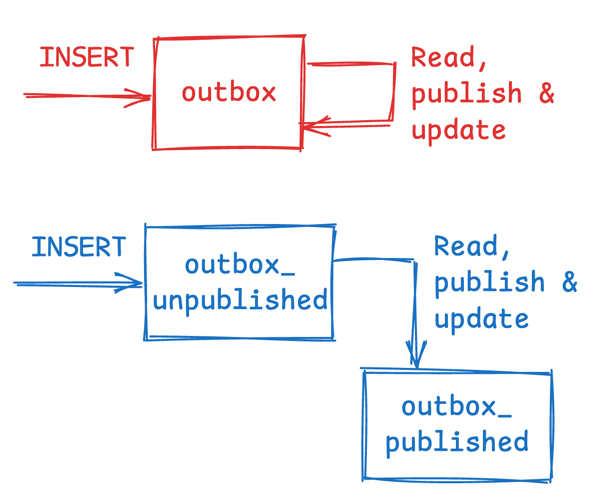
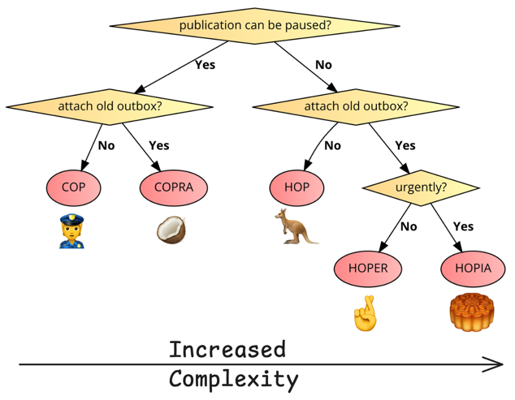
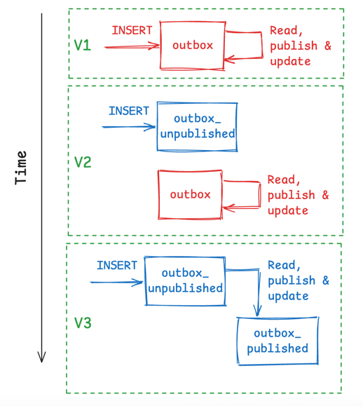
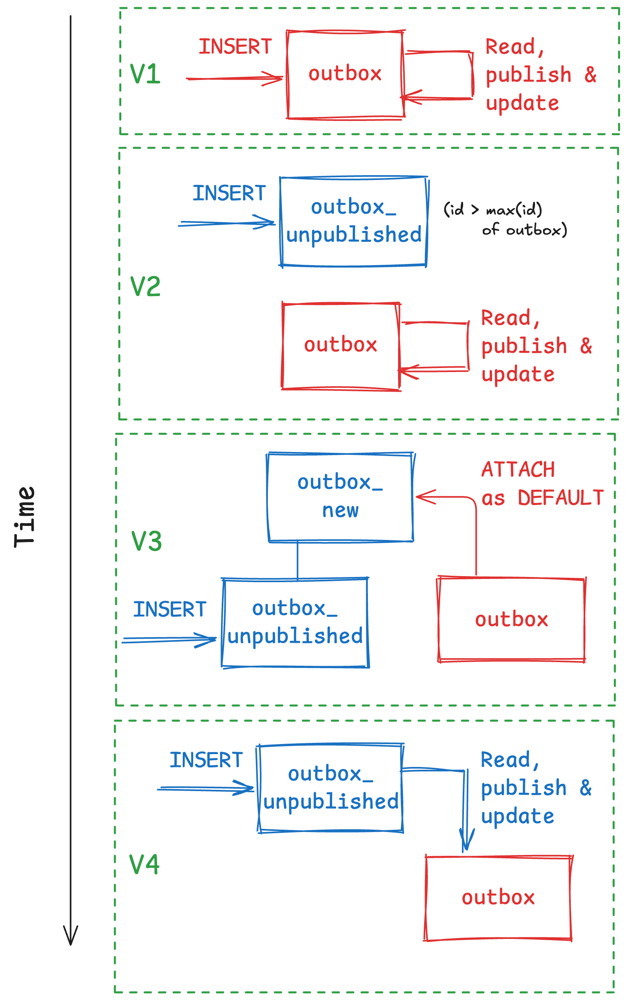
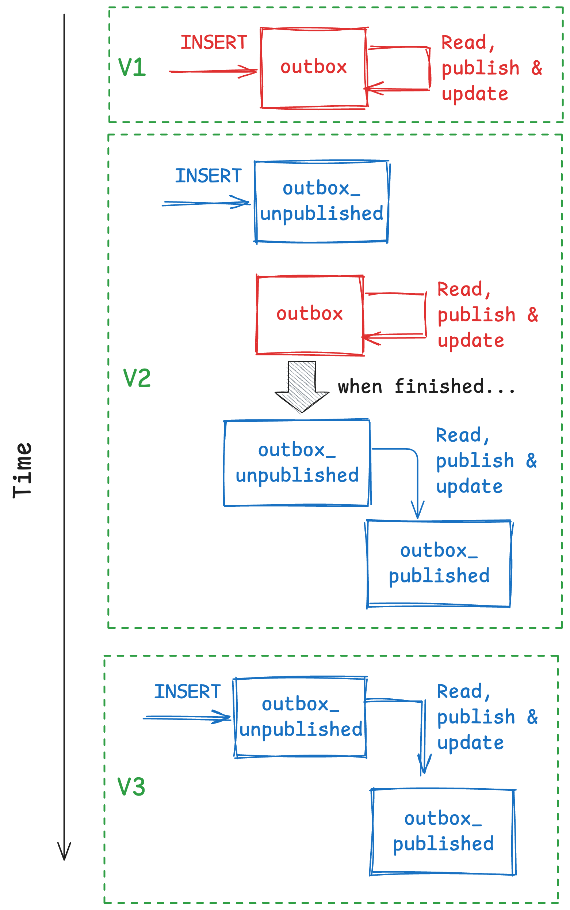
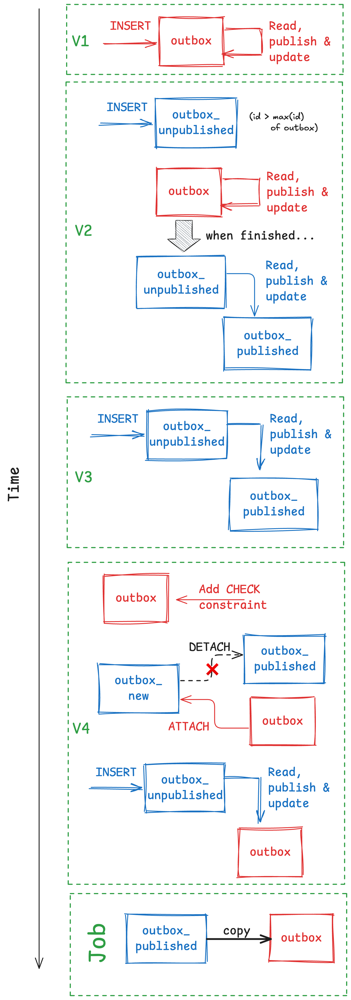

# Title: PostgreSQL + Outbox Pattern Revamped — Part 2

[Part 1 of this series](https://dev.to/msdousti/postgresql-outbox-pattern-revamped-part-1-3lai/) introduced the outbox pattern as a reliable approach for message delivery in distributed systems, while highlighting several implementation pitfalls that can lead to failures. These include sorting by `created_at`, incorrect data types, suboptimal indexing, overly large batch selections, poison pill messages, and inefficient index or visibility checks. A key insight was the performance impact of stale indexes, especially in high-throughput systems. To address this, the post proposed a revamped design using partitioned tables, which simplifies cleanup and mitigates visibility issues. Below is a summary of the traditional vs. revamped design, along with the DDL for both. Throughout this article, we will use the red color to indicate the traditional design and the blue color for the revamped design. Notice the update to the `published_at` column of the `outbox_unpublished` partition causes the record to be deleted from it and inserted into the `outbox_published` partition, which is a key feature of the revamped design.



Traditional (non-partitioned) outbox table:
```sql
CREATE TABLE outbox (
    id INT8 GENERATED ALWAYS AS IDENTITY PRIMARY KEY,
    payload JSON NOT NULL,
    created_at TIMESTAMPTZ NOT NULL DEFAULT NOW(),
    published_at TIMESTAMPTZ
);

CREATE INDEX outbox_unpublished_id_idx
    ON outbox (id)
    WHERE published_at IS NULL;
```

Revamped partitioned outbox tables:
```sql
CREATE TABLE outbox_new (
    id INT8 GENERATED ALWAYS AS IDENTITY,
    payload JSON NOT NULL,
    created_at TIMESTAMPTZ NOT NULL DEFAULT NOW(),
    published_at TIMESTAMPTZ
)
PARTITION BY LIST (published_at);

CREATE TABLE outbox_unpublished
    PARTITION OF outbox_new
        FOR VALUES IN (NULL);

CREATE TABLE outbox_published
    PARTITION OF outbox_new
        DEFAULT;

CREATE INDEX outbox_new_unpublished_id_idx
    ON outbox_unpublished (id);
```

Although this approach is easily applicable to new systems, applying it to existing databases is less straightforward due to PostgreSQL's limitations around retrofitting table partitioning.

In this second part, we will first explore design patterns for migration from a "traditional" outbox table to a partitioned one. We cover five scenarios and for each scenario, introduce a migration pattern. Next, we will pertain to the `autovacuum` settings for the outbox tables, and how to tune them for optimal performance. Finally, we will discuss index maintenance for the outbox tables, which is crucial for high-throughput systems.

# Outbox migration patterns
Let's consider the scenario that we have an existing service with a traditional outbox table, and we want to migrate to a partitioned outbox table. We will use some schematics to illustrate the migration process, and assume a rolling update approach where the new version of the service is deployed alongside the old one, and they co-exist for a while. This is the most common scenario in production systems, where we cannot afford downtime or data loss. Depending on the requirements, we may have to deploy several versions of the service. The services will be denoted by the green color, and the version number like `V1`, `V2`, etc.

Below, I will describe five patterns for migrating the outbox table, in the increasing order of complexity. If your requirements allow for a simpler approach, you can choose one of the simpler patterns. If you need more flexibility or performance, you can opt for a more complex pattern. Each pattern is given a mnemonic acronym to help you remember it, and also there is a flowchart to help you decide which pattern to use. The mnemonics are meaningful names, though some of them are not well-known English words. So, below the flowchart, I used a symbol to indicate the meaning of each mnemonic. 😉

1. **COP: Cold Outbox Partitioning**. This is the simplest pattern, where you can stop the publication of messages for a short while (e.g., 10 minutes).
2. **COPRA: Cold Outbox Partitioning w/ Rapid Attachment**. This pattern is similar to COP, except that the old outbox has to be rapidly attached to the new partitioned outbox table as the `outbox_published` partition.
3. **HOP: Hot Outbox Partitioning**. In this pattern, your service cannot afford to stop the publication of messages, but you do not need to attach the old outbox table to the new partitioned outbox table.
4. **HOPER: Hot Outbox Partitioning w/ Eventual Replacement**. This pattern is similar to HOP, except that the old outbox table eventually replaces the `outbox_published` partition, and newly published messages are copied over. No immediate access to the old outbox table is required, but it can be accessed later if needed.
5. **HOPIA: Hot Outbox Partitioning w/ Immediate Access**. This is by far the most complex pattern, with all requirements of HOP, and your service needs uninterrupted access to all the published messages.

The decision flowchart below can help you choose the right pattern for your requirements. The next sections will describe each pattern in detail.



## COP: Cold Outbox Partitioning
COP is the simplest pattern for migration from a traditional outbox table to a partitioned one. The requirements are as relaxed as possible:
1. **Paused publication:** You can stop the publication of messages for a short while (e.g., 10 minutes).
2. **Independent lifecycle:** The existing data in the old outbox table is not needed to be available in the new partitioned setup. You can leave it as a separate table, or drop it if you want to save space.

An example is a service that periodically uses the outbox. For instance, in our company, we have an "interest service" that uses the outbox during the nightly accrual or the monthly interest payout. In all other times, the outbox is rarely used, and therefore we can afford to pause the publication of messages for a short while during the migration.

Given these requirements, the migration process is straightforward:
1. `V1` is using the traditional outbox table.
2. `V2` is deployed with the new partitioned outbox table:
    * Insertions are now made into the **new** partitioned outbox table.
    * Publication continues from the **old** outbox table, until there are no more messages to publish.
3. `V3` is deployed where both insertions and publication are now performed over the **new** partitioned outbox table.

Between the `V2` and `V3` deployments, there is a short period where unpublished messages accumulated in the `outbox_unpublished` table, and as such the publication is effectively paused.

Let's depict this process in a schematic. Notice that due to the rolling deployment, `V1` and `V2` co-exist for a while, and the same applies to `V2` and `V3`. However, `V1` and `V3` do not co-exist. Also, `V3` is only deployed after all messages in the old `outbox` table are published. To prevent name clashes, let's assume that the new partitioned outbox table is named `outbox_new`.



## COPRA: Cold Outbox Partitioning w/ Rapid Attachment
COPRA is the second-simplest pattern—after COP—for migration from a traditional outbox table to a partitioned one. The requirement on paused publication is the same as before, but the existing data in the old outbox table is needed to be available in the new partitioned setup:
1. **Paused publication:** You can stop the publication of messages for a short while (e.g., 10 minutes).
2. **Rapid attachment:** The existing data in the old outbox table has to be available in the new partitioned setup.

An example is when the application performs some kind of analytical query on the outbox table, or there is a logical replication setup that replicates the outbox table to another database. In this case, we cannot afford to lose the existing data in the old outbox table, and we need to attach it to the new partitioned outbox table.

The DDL to create the new partitioned outbox table is a bit different:
* It won't create the `outbox_published` partition, as we will attach the old outbox table to it later.
* The `id` column has to be generated with a higher starting value to avoid clashes with the existing `id` values in the old outbox table.

```sql
CREATE TABLE outbox_new (
    -- The start value of the identity column must be greater than 
    -- the greatest id of outbox to avoid clashes.
    -- 1_000_000 is used for illustration only.
    id INT8 GENERATED ALWAYS AS IDENTITY (START 1_000_000),
    payload JSON NOT NULL,
    created_at TIMESTAMPTZ NOT NULL DEFAULT NOW(),
    published_at TIMESTAMPTZ
)
PARTITION BY LIST (published_at);

CREATE TABLE outbox_unpublished
    PARTITION OF outbox_new
        FOR VALUES IN (NULL);

CREATE INDEX outbox_new_unpublished_id_idx
    ON outbox_unpublished (id);
```

The attachment of the old outbox table to the new partitioned outbox table can be done with the following DDLs:
```sql
-- The new partition may not contain an identity column.
ALTER TABLE outbox ALTER COLUMN id DROP IDENTITY; 

-- This will lock the table, see below.
ALTER TABLE outbox_new
    ATTACH PARTITION outbox
        DEFAULT;
```

You may also want to change or drop the indexes on the old outbox table (e.g., the primary key). A crucial point here, according to the [PostgreSQL documentation](https://www.postgresql.org/docs/current/ddl-partitioning.html), is as follows:

> Note that when running the `ATTACH PARTITION` command, the table will be scanned to validate the partition constraint while holding an `ACCESS EXCLUSIVE` lock on that partition.
> 
> It is recommended to avoid this scan by creating a `CHECK` constraint matching the expected partition constraint on the table prior to attaching it. Once the `ATTACH PARTITION` is complete, it is recommended to drop the now-redundant `CHECK` constraint.

In the above example, the `outbox` table will be locked exclusively, to check that it satisfies the condition of being the `DEFAULT` partition of the `outbox_new` table. This means that all the rows must satisfy the condition `published_at IS NOT NULL`. If the outbox table is large, this can take a considerable amount of time. It can be OK if:
1. The `outbox` table does not have to be accessed during the migration, and
2. The publication can remain paused for a while.

If #1 is not the case, you can use the `CHECK` constraint as the documentation suggests, and elaborated below. If #2 is not the case, you can use the `HOP` pattern instead, which does not require pausing publication.

To use the `CHECK` constraint approach, you can follow these steps. Note that these steps must be done in separate transactions. The first step adds a `CHECK` constraint to the `outbox` table, in the `NOT VALID` mode. This means the constraint is only enforced for new rows (which in this case we don't expect any, since no new insertions are made into the `outbox` table for now). The second step validates the constraint, which will check all the existing rows in the `outbox` table, but it will not lock the table in the ACCESS EXCLUSIVE mode (or does so only very briefly to mark the constraint as valid at the end). The third step attaches the `outbox` table to the `outbox_new` table as the `DEFAULT` partition. The fourth step drops the now-redundant `CHECK` constraint.

```sql
-- Add a constraint with NOT VALID option to avoid locking the table.
ALTER TABLE outbox
    ADD CONSTRAINT outbox_published_check
        CHECK (published_at IS NOT NULL)
        NOT VALID;

-- In a separate transaction, validate the constraint.
ALTER TABLE outbox
    VALIDATE CONSTRAINT outbox_published_check;

-- In a separate transaction, attach the partition.
ALTER TABLE outbox_new
    ATTACH PARTITION outbox
        DEFAULT;

-- In a separate transaction, drop the now-redundant constraint.
ALTER TABLE outbox
    DROP CONSTRAINT outbox_published_check;
```

According to the above discussion, the migration process is as follows:
1. `V1` is using the traditional outbox table.
2. `V2` is deployed with `outbox_new` table, having `outbox_unpublished` as the only partition:
   * Insertions are now made into the **new** partitioned outbox table.
   * Publication continues from the **old** outbox table, until there are no more messages to publish.
3. `V3` is deployed which attaches the existing `outbox` table to the new partitioned outbox table as the `DEFAULT` partition.
   * This can be done with or without using the `CHECK` constraint approach, depending on whether an exclusive lock on the `outbox` table is acceptable.
4. `V4` is deployed where both insertions and publication are now performed over the **new** partitioned outbox table.

The schematics below illustrate the COPRA migration pattern.



## HOP: Hot Outbox Partitioning
HOP is the first pattern for migration from a traditional outbox table to a partitioned one, where we cannot afford to pause the publication of messages. The requirements are as follows:
1. **Immediate publication:** You cannot stop the publication of messages, even for a short while.
2. **Independent lifecycle:** The existing data in the old outbox table is not needed to be available in the new partitioned setup. You can leave it as a separate table, or drop it if you want to save space.

An example is a service that continuously uses the outbox, such as a payment service that processes transactions in real-time. In this case, we cannot stop the publication of messages, since it would disrupt other services that depend on the message delivery.

Contrary to the stringent requirement on the publication, the migration process is pretty straightforward:
1. `V1` is using the traditional outbox table.
2. `V2` is deployed with the new partitioned outbox table:
   * Insertions are now made into the **new** partitioned outbox table.
   * Publication continues from the **old** outbox table, until there are no more messages to publish.
   * Then, publication continues from the **new** partitioned outbox table.
3. `V3` is deployed where both insertions and publication are now performed over the **new** partitioned outbox table.


The following PL/pgSQL code shows how to implement `V2` by keeping the variable `outbox_table`, that points to the outbox table to be used for publication. Initially, it points to the old outbox table, and then it switches to the new partitioned outbox table after all messages in the old outbox table are published. This way, the service does not have to check the source table at each iteration, which improves the performance.

```sql
DO $$
DECLARE
    outbox_table TEXT := 'outbox';
    count_updated INT;
BEGIN
    LOOP
        EXECUTE format(
            $query$
            WITH t AS (
                SELECT id
                FROM %I
                WHERE published_at IS NULL
                ORDER BY id
                LIMIT 100
            )
            UPDATE %I
            SET published_at = NOW()
            WHERE id IN (SELECT id FROM t)
            AND published_at IS NULL;
            $query$,
            outbox_table, 
            outbox_table
        );

        GET DIAGNOSTICS count_updated = ROW_COUNT;

        IF count_updated = 0 and outbox_table = 'outbox' THEN
            -- No more unpublished messages in `outbox`
            -- Switch to the new partitioned outbox table.
            outbox_table := 'outbox_new';
        END IF;

        COMMIT;
    END LOOP;
END $$;
```

The schematics below illustrate the HOP migration pattern.


## HOPER: Hot Outbox Partitioning w/ Eventual Replacement
HOPER is a migration pattern for the following requirements:
1. **Immediate publication:** You cannot stop the publication of messages, even for a short while.
2. **Eventual replacement:** The existing data in the old outbox table is needed to be available in the new partitioned setup, but it does not have to be immediately accessible. The eventual goal is to have all published messages in a single partition.

The steps are a combination of the HOP and COPRA patterns:
1. `V1` is using the traditional outbox table.
2. `V2` is deployed with the new partitioned outbox table:
   * The starting value of the `id` column is set to a higher value to avoid clashes with the existing `id` values in the old outbox table, as explained in the COPRA section above.
   * Insertions are now made into the **new** partitioned outbox table.
   * Publication continues from the **old** outbox table, until there are no more messages to publish.
   * Then, publication continues from the **new** partitioned outbox table.
3. `V3` is deployed where both insertions and publication are now performed over the **new** partitioned outbox table.
4. `V4` is deployed which:
   * Drops `IDENTITY` from the `outbox->id` column.
   * First applies and NOT VALID `CHECK` constraint to the `outbox` table, and then validates it in a separate transaction. This is fully explained in the COPRA section above.
   * In a single transaction: Detaches the `outbox_published` DEFAULT partition from `outbox_new`, and instead attaches the existing `outbox` table to the as the `DEFAULT` partition.
   * Drops the now-redundant `CHECK` constraint from the `outbox` table.
* A job is deployed which gradually copies all the rows from the `outbox_published` partition to the `outbox` table, and then drops the `outbox_published` partition.


The schematics below illustrate the HOPER migration pattern.


## HOPIA: Hot Outbox Partitioning w/ Immediate Access
HOPIA is the migration pattern for the strictest requirements:
1. **Immediate publication:** You cannot stop the publication of messages, even for a short while.
2. **Immediate access:** All the published data has to be immediately accessible. There is no time window to copy the data from one table to another.

While this seems very complex, there is actually a simple solution: Just follow the HOPER pattern, but add an AFTER-INSERT trigger to the `outbox_published` partition that copies the row to the `outbox` table. This way, all the published messages are immediately available in the `outbox` table, and you can access them at any time: There's no need to copy them later.

The trigger can be implemented as follows:
```sql
-- The new partition may not contain an identity column.
ALTER TABLE outbox ALTER COLUMN id DROP IDENTITY;

CREATE OR REPLACE FUNCTION outbox_published_insert_trigger()
RETURNS TRIGGER AS $$
BEGIN
    INSERT INTO outbox (id, payload, created_at, published_at)
    VALUES (NEW.id, NEW.payload, NEW.created_at, NEW.published_at);
    RETURN NEW;
END;
$$ LANGUAGE plpgsql;

CREATE TRIGGER outbox_published_insert
AFTER INSERT ON outbox_published
FOR EACH ROW
EXECUTE FUNCTION outbox_published_insert_trigger();
```

The steps are a similar to the HOPER pattern, but with the addition of the trigger:
1. `V1` is using the traditional outbox table.
2. `V2` is deployed with the new partitioned outbox table:
   * The starting value of the `id` column is set to a higher value to avoid clashes with the existing `id` values in the old outbox table, as explained in the COPRA section above.
   * The **above trigger** is created on the `outbox_published` partition.
   * Insertions are now made into the **new** partitioned outbox table.
   * Publication continues from the **old** outbox table, until there are no more messages to publish.
   * Then, publication continues from the **new** partitioned outbox table.
3. `V3` is deployed where both insertions and publication are now performed over the **new** partitioned outbox table.
4. `V4` is deployed which:
   * Drops `IDENTITY` from the `outbox->id` column.
   * First applies and NOT VALID `CHECK` constraint to the `outbox` table, and then validates it in a separate transaction. This is fully explained in the COPRA section above.
   * In a single transaction: Detaches the `outbox_published` DEFAULT partition from `outbox_new`, and instead attaches the existing `outbox` table to the as the `DEFAULT` partition.
   * Drops the now-redundant `CHECK` constraint from the `outbox` table.

If needed, you can also drop the `outbox_published` partition after the migration is complete, since all the published messages are now available in the `outbox` table.

The schematics are very similar to the HOPER pattern, with the addition of the trigger in `V2` and the removal of the copy job. For brevity, I will not repeat the schematics here, but you can refer to the HOPER section above.

# Tuning AUTOVACUUM for outbox tables
Let's take a detour from the migration patterns and discuss how to tune the `autovacuum` settings for the outbox tables. This is important to ensure that the outbox tables are maintained properly, especially in high-throughput systems where many messages are inserted and published frequently. This section assumes familiarity with the `autovacuum` feature in PostgreSQL. A good, in-depth article is Laurenz Albe's [Tuning PostgreSQL autovacuum](https://www.cybertec-postgresql.com/en/tuning-autovacuum-postgresql/).

By default, PostgreSQL's `autovacuum` settings are designed to work well on the medium-sized tables:
```text
postgres=# \dconfig *autovacuum_*
         List of configuration parameters
               Parameter               |   Value
---------------------------------------+-----------
 autovacuum_analyze_scale_factor       | 0.1
 autovacuum_analyze_threshold          | 50
 autovacuum_freeze_max_age             | 200000000
 autovacuum_max_workers                | 3
 autovacuum_multixact_freeze_max_age   | 400000000
 autovacuum_naptime                    | 1min
 autovacuum_vacuum_cost_delay          | 2ms
 autovacuum_vacuum_cost_limit          | -1
 autovacuum_vacuum_insert_scale_factor | 0.2
 autovacuum_vacuum_insert_threshold    | 1000
 autovacuum_vacuum_scale_factor        | 0.2
 autovacuum_vacuum_threshold           | 50
 autovacuum_work_mem                   | -1
 log_autovacuum_min_duration           | 10min
(14 rows)
```

The following table summarizes the most important settings and their default values:

| AUTOVACUUM task             | Trigger                                            |
|-----------------------------|----------------------------------------------------|
| Vacuum run on update/delete | At least 20% of the table changes plus 50 rows     |
| Vacuum run on insert        | At least 20% of the table changes plus 1000 rows   |
| Analyze run                 | At least 10% of the table changes plus 50 rows     |

In our revamped outbox design, there's an imbalance between the partitions:
* The `outbox_unpublished` partition is frequently inserted to and updated (resulting in delete), but its size is usually small.
* The `outbox_published` partition is only inserted to, but it can grow indefinitely large.

Since PostgreSQL default `autovacuum` settings are designed for small and medium-sized tables, we usually do not have to tune them for the `outbox_unpublished` partition. However, keep an eye on the amount of time `autovacuum` takes to run on this partition, plus whether the query for the `outbox_unpublished` partition is efficient. For both purposes, you can monitor the server logs. For the latter, you would need `log_min_duration_statement` set to a low value, such as 100ms, or use the `auto_explain` extension. Another possibility is to use the `pg_stat_statements` extension, which can help you identify slow queries and their execution plans.

For the insert-only table `outbox_published`, vacuuming is not needed except for preventing the transaction ID wraparound.
If it is not used in the application code, it does not have to be analyzed either. However, since disabling auto-analyze is not possible without disabling `autovacuum` entirely, we can tune the parameters to make it less frequent. Here's an example to run both vacuum and analyze on the `outbox_published` partition every 100K rows inserted, regardless of the table size. This gives you a consistent behavior, but it is suitable only for the case where the application code does not query the `outbox_published` partition directly. There is also no one-size-fits-all solution, so you may need to adjust the values based on your workload and performance requirements.

```sql
ALTER TABLE outbox_published
   SET (
      autovacuum_vacuum_insert_scale_factor = 0,
      autovacuum_vacuum_insert_threshold = 100_000,
      autovacuum_analyze_scale_factor = 0,
      autovacuum_analyze_threshold = 100_000
      );
```


# Outbox table index maintenance
In the revamped outbox design, we have a single indexes on the `outbox_unpublished` partition, and no indexes on the `outbox_published` partition:

```sql
CREATE INDEX outbox_new_unpublished_id_idx
    ON outbox_unpublished (id);
```

The `outbox_unpublished` partition is frequently inserted to and updated (resulting in delete), so the index on it is supposed to be severely bloated over time. We'll use the `pgstattuple` extension to monitor the index bloat. It's a heavy operation, so do not do it in production.

```sql
CREATE EXTENSION IF NOT EXISTS pgstattuple;
```

On a freshly created `outbox_unpublished` partition, the following query shows that the index is empty, thus not bloated at all:
```sql
SELECT * FROM pgstatindex('outbox_new_unpublished_id_idx') \gx
```

```text
-[ RECORD 1 ]------+-----
version            | 4
tree_level         | 0
index_size         | 8192
root_block_no      | 0
internal_pages     | 0
leaf_pages         | 0
empty_pages        | 0
deleted_pages      | 0
avg_leaf_density   | NaN
leaf_fragmentation | NaN
```

Let's insert 100K rows into the `outbox_new` table, and see how the index looks like after that.

```sql
INSERT INTO outbox_new (payload)
SELECT '{}'
FROM generate_series(1, 100_000);

SELECT * FROM pgstatindex('outbox_new_unpublished_id_idx') \gx
```

```text
-[ RECORD 1 ]------+--------
version            | 4
tree_level         | 1
index_size         | 2260992
root_block_no      | 3
internal_pages     | 1
leaf_pages         | 274
empty_pages        | 0
deleted_pages      | 0
avg_leaf_density   | 89.83
leaf_fragmentation | 0
```

As you can see, `avg_leaf_density` is almost at 90%, which is the default fillfactor for B-Tree indexes in PostgreSQL. This means that the index is filled to the maximum capacity, and there is no bloat yet.

Let's update the `published_at` column of all the rows, and see how the index looks like after that.

```sql
UPDATE outbox_new
SET published_at = NOW()
WHERE published_at IS NULL;

SELECT * FROM pgstatindex('outbox_new_unpublished_id_idx') \gx
```

```text
-[ RECORD 1 ]------+--------
version            | 4
tree_level         | 1
index_size         | 2260992
root_block_no      | 3
internal_pages     | 1
leaf_pages         | 274
empty_pages        | 0
deleted_pages      | 0
avg_leaf_density   | 89.83
leaf_fragmentation | 0
```

Hm, nothing?! How can that be? The reason is that we ran the query `pgstatindex(..)` immediately after the update, and AUTOVACUUM didn't have a chance to run yet. If you run it after a few minutes (or after a manual `VACUUM`), you will see that the index is bloated:

```text
-[ RECORD 1 ]------+--------
version            | 4
tree_level         | 1
index_size         | 2260992
root_block_no      | 3
internal_pages     | 1
leaf_pages         | 1
empty_pages        | 0
deleted_pages      | 273
avg_leaf_density   | 0.05
leaf_fragmentation | 0
```

Only 5% of the index is leaf pages is used, which shows that the index is severely bloated. Notice that the (AUTO-)VACUUM did not remove the index bloat; it only marked them as invalid.

Fortunately, it's easy to remove the index bloat by running a `REINDEX` command on the index or the table. To prevent an EXCLUSIVE lock on the table, you should use the `CONCURRENTLY` option, which will take longer but will not block other operations on the table. Since the `outbox_unpublished` partition is supposed to be small, the `REINDEX` command should not take too long:

```sql
REINDEX INDEX CONCURRENTLY outbox_new_unpublished_id_idx;
```
OR
```sql
REINDEX TABLE CONCURRENTLY outbox_unpublished;
```

The index maintenance is not a one-time operation, but rather a periodic task that should be run regularly to keep the index in good shape. The frequency of the maintenance depends on the workload and the size of the `outbox_unpublished` partition. You can use the `pg_cron` extension to schedule the maintenance task, or use a job scheduler like `cron` or K8s CronJobs to run the `REINDEX` command periodically. There's also a nice bash script by Vitaliy Kukharik, called [pg_auto_reindexer](https://github.com/vitabaks/pg_auto_reindexer), which can run during the set time and reindex all the indexes that are bloated more than a certain threshold. It can be used to automate the index maintenance process.

# Conclusion

In this article, we explored various migration patterns for transitioning from a traditional outbox table to a partitioned one in PostgreSQL. We covered five patterns—COP, COPRA, HOP, HOPER, and HOPIA—each designed for different requirements regarding publication pauses and data accessibility. The choice of pattern depends on your specific needs, with simpler patterns like COP being suitable for systems that can tolerate brief publication pauses, while more complex patterns like HOPIA address scenarios requiring continuous publication and immediate data access.

We also discussed important operational aspects, including tuning autovacuum settings for outbox tables and maintaining indexes to prevent performance degradation. The partitioned outbox design offers significant advantages in terms of performance and maintenance, particularly for high-throughput systems.

By implementing these patterns and following the recommended maintenance practices, you can achieve a more efficient and reliable outbox implementation that scales well with your system's growth while minimizing the common pitfalls associated with traditional outbox tables.
